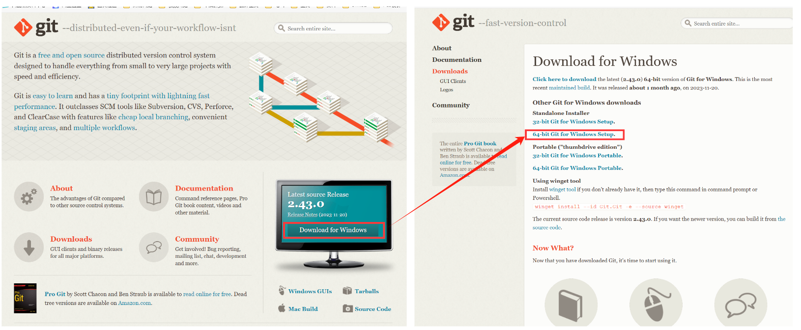
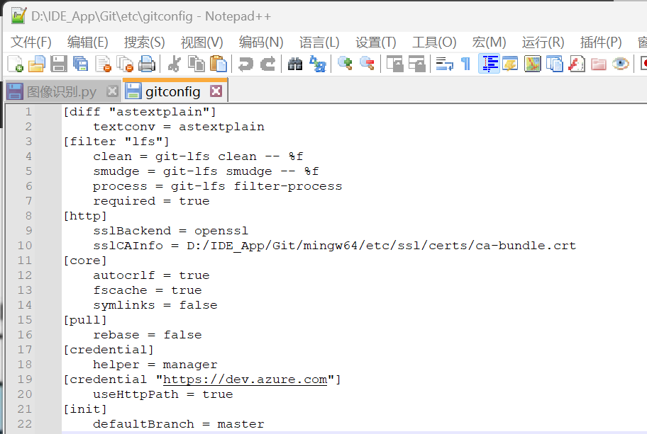
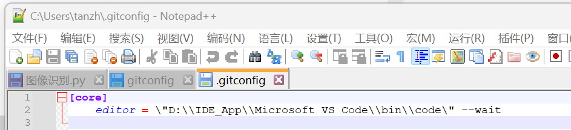
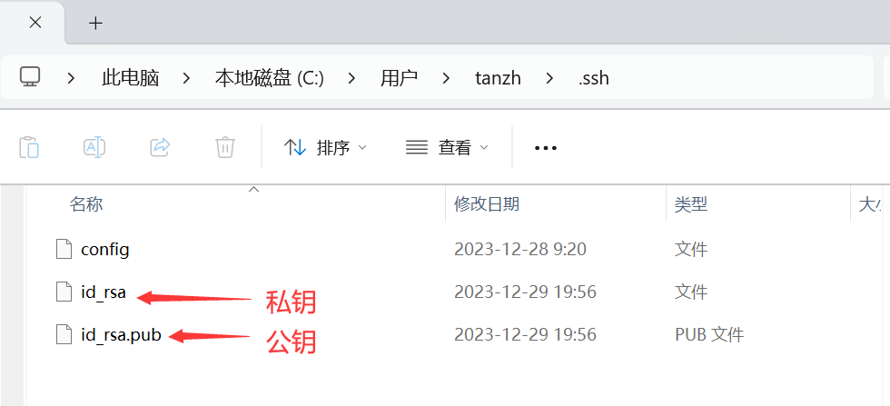
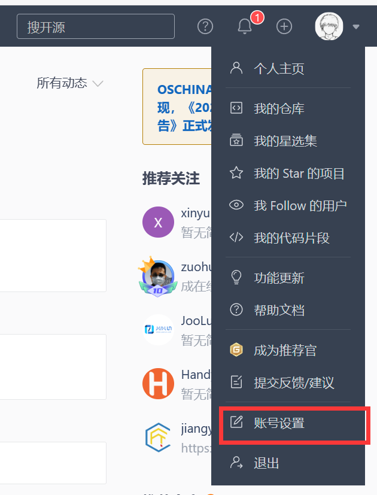
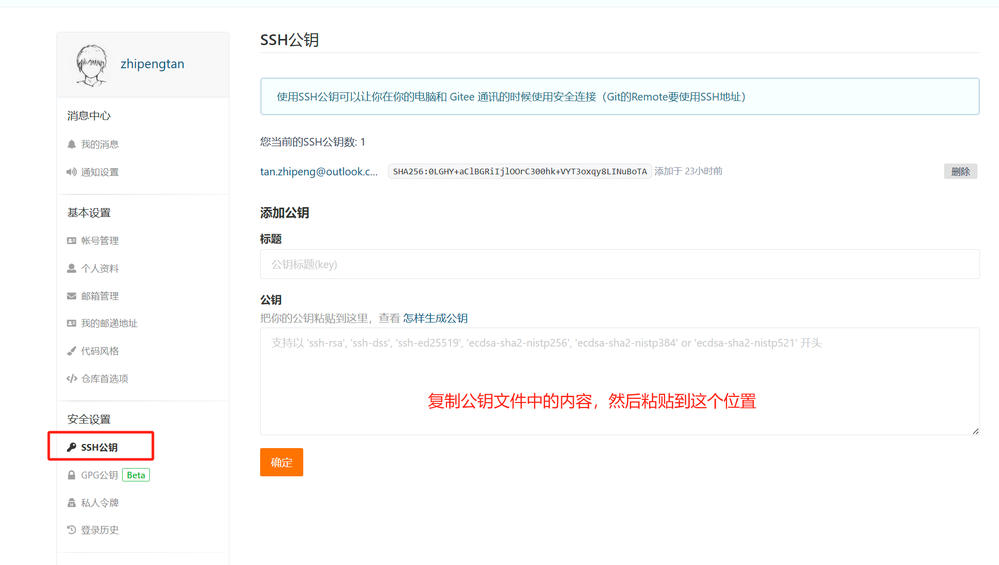
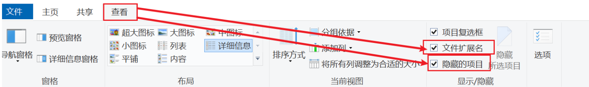
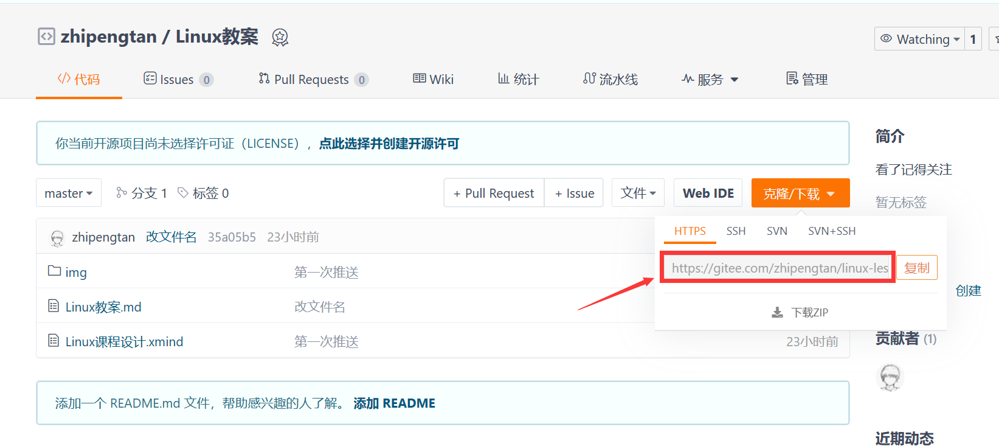
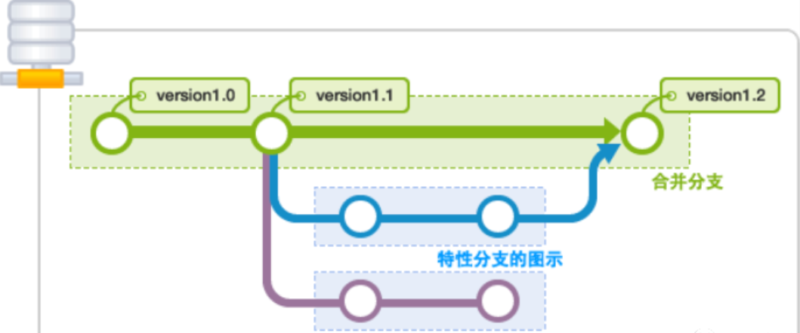

## Ubuntu基本操作

我们所使用的Ubuntu是拥有图形化界面的，但是我们在以后的工作中，是不会去使用


# Linux编程环境搭建

## 一、Git工具


### 1.1 版本控制

#### 1.1.1 版本控制

#### 1.1.2 常见的版本控制工具

>   Git
>
>   SVN（Subversion）
>
>   CVS（Concurrent Versions System）
>
>   VSS（Micorosoft Visual SourceSafe）
>
>   TFS（Team Foundation Server）

### 1.2 Git安装

#### 1.2.1 资料获取

>   官网资料：[Git - Downloading Package (git-scm.com)](https://git-scm.com/download/win)
>
>   本地资料：`【Linux基础】_06_给学生的资料\00_软件&系统`

#### 1.2.2 官网下载



#### 1.2.3 Git安装

>   直接下一步就好了，没那么复杂，别想那么多


### 1.3 git的配置

#### 1.3.1 查看配置文件

我们这里给大家介绍几个命令，用于查看git的相关配置

```shell
# 查看git配置
git config -l
# 查看系统配置
git config --system --list
# 查看本地配置
git config --global --list
```

#### 1.3.2 git相关的配置文件

我们可以通过下面的路径，去找到我们的配置文件，这里主要是要让大家知道，我们在终端中所看到的内容，都是从系统中各个文件所看到的，也就是说如果我们要去修改，可以通过命令也可以直接修改其文件，对我们的git 进行配置。

```shell
\Git\etc\gitconfig    系统级配置文件  git config --system --list
```




```shell
C:\Users\tanzh\.gitconfig  用户级配置文件			git config --global --list
```

这里的位置是在用户目录下面，在其下面找到.gitconfig，这个文件是一个隐藏文件。



#### 1.3.3git配置用户文件

==设置== ==用户名&邮箱==


在前面，我们已经理解了从什么地方去找我们的配置文件，现在我们需要将我们的`用户名`以及`邮箱` 配置到我们的文件内部，这里尽量使用我们的真实邮箱。

```shell
# 设置用户名
git config --global user.name tan.zhipeng
# 设置邮箱
git config --global user.email tan.zhipeng@outlook.com
```

### 1.4 git基础理论

#### 1.4.1 工作区域

我们所使用的git 是区分了4个工作区域，其中，3个工作区域在本地，即`工作区` 、 `暂存区`、`本地仓库`这三个，此外还有一个`远程仓库`，他们之间的关系如下：


-   workspace：工作区
-   staging area：暂存区/缓存区
-   local repository：版本库或本地仓库
-   remote repository：远程仓库

```
【工作区】：workspace 项目文件所在地，即平时存放代码的地方
【暂存区】：index 用于存放临时的改动，其本质上是一个文件，保存即将要提交的列表信息
【本地仓库】：Repository 就是安全存放数据的位置，这里面有你提交到所有版本的数据。其中HEAD指向最新放入仓库的版本
【远程仓库】：Remote 远程仓库是代码托管平台，也就是我们存放代码的分布式服务器，比较有名的有github 、 gitee
```

在我们的工程目录下面，当我们使用了git 后，会出现一个`HEAD`文件

#### 1.4.2 工作流程

Git的工作流程一般如下：

>   1、在工作区中编写代码、文件。
>
>   2、将需要进行版本控制的文件导入到暂存区 index 
>
>   3、将暂存区的文件提交到 本地仓库


基于我们的工作流程，让我们的Git衍生了三种状态 

-   已修改（modified）
-   已缓存（staged）
-   已提交（committed）

### 1.5 Git项目搭建


#### 1.5.1 Git项目创建

当我们需要在当前目录下面去创建一个新的目录的时候，我们可以使用下面的目录进行创建

```shell
# 使用指令创建git 工程
$ git init
```

当我们执行完成本命令后，我们的工程目录下面就会多出一个.git的文件夹

#### 1.5.2 Git项目克隆

此外，除了上面的那种直接创建项目，我们也可以在目录中克隆别人的项目，也就是将远程服务器上的项目完整的镜像到本地。

```shell
# 使用指令克隆指定的url 的项目
$ git clone [url]
```

### 1.6 Git文件操作

#### 1.6.1 文件的四种状态

版本控制就是对文件的版本控制，要对文件进行修改、提交等操作，首先要知道文件当前在什么状态，不然可能会提交了现在还不想提交的文件，或者要提交的文件没提交上。

>   **未跟踪** (Untracked): 此文件在文件夹中, 但并没有加入到git库, 不参与版本控制. 通过git add 状态变为Staged.


>   **文件已经入库 ** (Unmodify): 文件入库但是未修改, 即版本库中的文件快照内容与文件夹中完全一致. 这种类型的文件有两种去处, 如果它被修改, 而变为Modified. 如果使用git rm移出版本库, 则成为Untracked文件


>   **文件已修改** (Modified): 文件已修改, 仅仅是修改, 并没有进行其他的操作. 这个文件也有两个去处, 通过git add可进入暂存staged状态, 使用git checkout 则丢弃修改过, 返回到unmodify状态, 这个git checkout即从库中取出文件, 覆盖当前修改 !


>   **暂存状态**  (Staged): . 执行git commit则将修改同步到库中, 这时库中的文件和本地文件又变为一致, 文件为Unmodify状态. 执行git reset HEAD filename取消暂存, 文件状态为Modified

#### 1.6.2 查看文件状态

使用命令进行查看文件的状态

```shell
#查看所有文件状态
$ git status
# 添加所有文件到暂存区
$ git add
# 提交暂存区中的内容到本地仓库
$ git commit
```

使用流程

```shell
# 首先使用git status 查看所有文件的状态
$ git status  				# 查看所有文件状态
$ git status [filename] 	# 查看指定文件状态

# 再使用git add 将文件添加到缓存区
$ git add . 				# 将所有文件添加到缓存区
$ git add [filename]		# 将指定文件添加到缓存器

# 当你使用git add 添加到缓存区后 可以使用 git status 命令去查看一下文件是否添加成功
$ git status 

# 成功完成这一步后，就可以将缓存区中的文件导入到本地仓库 命令 ：git commit 
$ git commit 				# 直接推送到本地仓库
$ git commit -m "加备注"	  # 对我们本次的推送加上注释
```

### 1.7 远程仓库— 以码云（gitee）为例

>   由于我们的github访问速度不佳，所以我们本次教学不使用gitee
>
>   当然你也可以自己去搭建一个自己的git仓库， 在你的远程Linux主机上部署gitlab 就可以了

#### 1.7.1 注册码云

>   网址：[Gitee - 基于 Git 的代码托管和研发协作平台](https://gitee.com/)

自己注册账号并完善账号信息

在以后你们找工作可以将我们的项目写到你们的简历上

#### 1.7.2 设置本机绑定SSH公钥，实现免密码登录

当你注册完成后，就可以生成一下你本机的SSH公钥，将这个公钥配置给`gitee`或者`github`，这样在后续的推送中就可以免密码登录了。

1.   在Git中输入ssh-keygne，生成本机的ssh密钥

```shell
# 生成ssh密钥指令     | 下面的指令使用一个人即可
#	单纯的生成ssh密钥
$ ssh-keygne
# 	生成ssh密钥并通过-t rsa 添加  rsa加密算法
$ ssh-keygne -t rsa
```

2.   当你使用完上面的指令后，在C盘的用户目录下面有一个`.ssh`的目录，当你使用了这个指令后，会就生成两个文件




3.   打开gitee ，点击你的头像，然后点击设置




4.   点击SSH公钥 ， 后面就是输入密码后就添加完成了



5.   后面就可以在仓库中去新建仓库了

#### 1.7.3 新建远程仓库


### 1.8 本地代码推送到gitee和github

#### 1.8.1 新建本地仓库

1.   在本地文件夹内，右键点击Git Bash，打开git的命令行窗口
2.   在命令行窗口中 输入 git init 用于初始化

```shell
$ git init	
```

运行完该命令后，会在你的文件夹内生成一个.git的隐藏文件

>   注意：.git文件是隐藏文件，如果看不到就可以根据下图操作打开显示隐藏文件
>
>   

#### 1.8.2 链接远程仓库 - gitee

1.   复制新建的远程仓库地址



2.   在git中输入下面的命令，进行与远程仓库的链接

```shell
# 这里的url 就是你远程仓库的地址，进行替换即可
$ git remote add origin [url] 
```

3.   更新本地仓库

```shell
# git pull origin master 是拉取远程仓库中master分支的代码到当前本地分支上
# origin	是远程名
# master	是远程仓库中的一个分支
$ git pull origin master
```

#### 1.8.3 将本地内容推送到远程 - gitee

1.   本地文件上传到缓存区

```shell
# 上传所有文件
$ git add .
# 上传指定文件
$ git add [文件名]
```

2.   提交文件并添加注释

```sh
# "" 中为注释内容
$ git commit -m "注释"
```

3.   将本地内容推送到远程

```sh
$ git push origin master
```

>   完成上面的操作，基本就对推送到远程这个事情就已经做完了， 我们可以去gitee中刷新一下，然后就可以看到我们的文件了

#### 1.8.4 链接远程仓库 - github

1.   查看当前远程仓库的设置

```sh
$ git remote -v
```

在这里会显示你的本地仓库，此时我们已经对gitee 进行远程链接了，所以我们就可以看到这些内容

```
origin-gitee <gitee仓库地址> (fetch)
origin-gitee <gitee仓库地址> (push)
```

2.   将新建好的github链接到本地仓库

```sh
$ git remote add origin-github <github仓库地址>
```

#### 1.8.5 将本地内容推送到远程 - github

1.   本地文件上传到缓存区

```shell
# 上传所有文件
$ git add .
# 上传指定文件
$ git add [文件名]
```

2.   提交文件并添加注释

```sh
# "" 中为注释内容
$ git commit -m "注释"
```

3.   将本地内容推送到远程

```sh
$ git push origin-github master
```

### 1.9 git的分支

分支在GIT中相对较难，分支就是科幻电影里面的平行宇宙，如果两个平行宇宙互不干扰，那对现在的你也没啥影响。不过，在某个时间点，两个平行宇宙合并了，我们就需要处理一些问题了！



#### 1.9.1 git分支相关命令

```sh

# 列出所有本地分支
git branch

# 列出所有远程分支
git branch -r

# 新建一个分支，但依然停留在当前分支
git branch [branch-name]

# 新建一个分支，并切换到该分支
git checkout -b [branch]

# 合并指定分支到当前分支
$ git merge [branch]

# 删除分支
$ git branch -d [branch-name]

# 删除远程分支
$ git push origin --delete [branch-name]
$ git branch -dr [remote/branch]
```

>   master主分支应该非常稳定，用来发布新版本，一般情况下不允许在上面工作，工作一般情况下在新建的dev分支上工作，工作完后，比如上要发布，或者说dev分支代码稳定后可以合并到主分支master上来。


## 二、VIM 工具


#### 1.1 VIM安装

1.   在终端中输入下面的指令进行安装

```shell
$ sudo apt install vim
```

#### 

#### 1.2 


