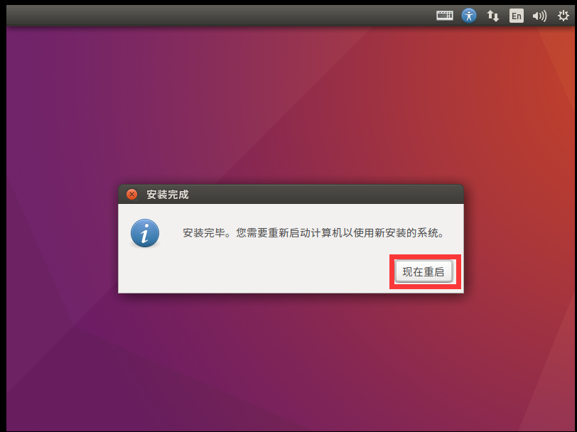
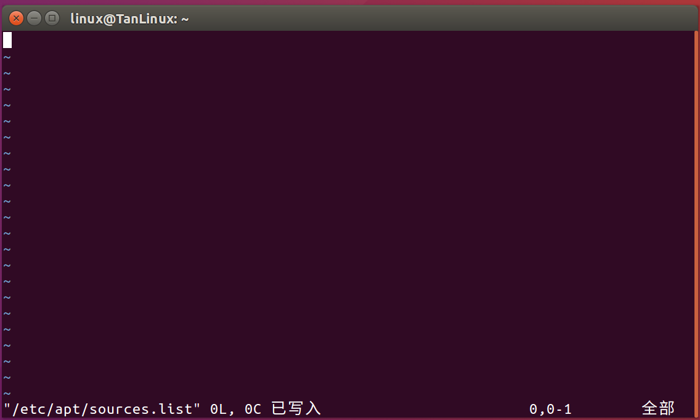

# 第一章 环境搭建

## 一、工具介绍

### 1.1 虚拟机软件

#### 1.1.1 获取软件

>   软件位置：`\【Linux基础】_06_给学生的资料\00_软件&系统\01_VMware16.0.zip`
>
>   软件位置：`\【Linux基础】_06_给学生的资料\00_软件&系统\01_VMware17.0.zip`

安装那个都可以，但是如果是安装的16版本，出现了系统不兼容的问题，则可以卸载16安装17版本。

#### 1.1.2 软件安装

>   资料位置：`\【Linux基础】_06_给学生的资料\01_Linux资料\VMware16.0安装教程.pdf`
>
>   资料位置：`\【Linux基础】_06_给学生的资料\01_Linux资料\VMware17.0安装教程.pdf`

可以根据我们资料中所提供的pdf文档，进行安装。

#### 1.1.3 软件介绍


### 1.2 Linux操作系统 - Ubuntu

#### 1.2.1 获取系统

>   软件位置：`\【Linux基础】_06_给学生的资料\00_软件&系统\03_ubuntu1604x64.rar`
>
>   软件位置：`\【Linux基础】_06_给学生的资料\00_软件&系统\04_ubuntu-18.04.1-desktop-amd64.iso`

两个都需要进行下载，第一个是我们已经配置好的Linux系统，可以直接使用的，第二个是未进行配置的系统


#### 1.3 Xshell&Xftp

#### 1.3.1 获取软件

>   软件位置：`\【Linux基础】_06_给学生的资料\00_软件&系 统\05_Xshell7.zip`
>
>   软件位置：`\【Linux基础】_06_给学生的资料\00_软件&系统\06_Xftp7.zip`

#### 1.3.2 软件介绍 - Xshell


Xshell是一款远程ssh登录Linux的软件，在日常的开发中，我们很多时候是服务器 + 本地主机的方式，也就是说，我们通过本地主机链接到远程服务器上进行开发，不会说直接在服务器机房进行开发，有的时候甚至服务器在北京，我们在长沙进行开发。


我们的Xshell软件就可以实现远程登录的功能，效果如下，当我们配置完成后，就可以看到我们的xshell链接到了Linux系统


### 1.3.2 软件介绍 - Xftp


xftp是基于ftp协议的远程文件传输协议，当我们在需要进行服务器和本机文件交互的的时候，就可以使用xftp软件，进行远程的软件交互

链接后的效果如下，我们可以随意的进行Linux和windows的文件传输


### 1.4 VsCode


### 1.4.1 获取软件

>   软件位置：`\【Linux基础】_06_给学生的资料\00_软件&系统\07_VSCodeUserSetup-x64-1.85.1.exe`
>
>   软件位置：`\【Linux基础】_06_给学生的资料\00_软件&系统\08_code_1.85.1-1702462158_amd64.deb`

第一个是windows版本的，第二个是Linux版本的，我们可以只安装Windows版本的


### 1.4.2 软件介绍

VScode全称是Visual Studio Code，是微软推出的一个跨平台的编辑器，能够在windows、Linux、IOS等平台上运行，通过安装一些插件可以让这个编辑器变成一个编译器。 VSCode支持C++、Python、Java、C#、Go等多种语言，功能强大、插件丰富并且启动速度极快，值得每个开发人员尝试一把！


>   vscode是我们后续开发的主力ide工具之一，很多的内容都需要使用到vscode


### 1.5 辅助工具

### 1.5.1 软件获取

>   软件位置：`\【Linux基础】_06_给学生的资料\00_软件&系统\09_YoudaoDict_dict_web_product.exe`
>
>   软件位置：`\【Linux基础】_06_给学生的资料\00_软件&系统\10_有道云笔记-7.2.161.exe`


第一个是翻译用的软件，我们在开发过程中很多使用会需要看英文文档，这个软件可以帮助我们进行截图翻译

第二个软件是笔记软件，我们每天的所学各位都需要进行记笔记，并提交到在线表格中去

### 1.6 Git


## 二、系统配置

### 1.2 系统配置 - Linux安装与配置

#### 1.2.1 VMware 虚拟机软件安装

>    这里是 以 vmware16.0 为例

1、解压【vmware16.0】


2、打开解压后的文件夹，鼠标右击【VMware-workstation-full-15.5.0-14665864】选择【以管理员身份运行】。


3、点击【下一步】。


4.勾选【我接受许可协议中的条款】，点击【下一步】。


5、点击【更改…】可更改安装位置（建议不要安装在C盘，可以在D盘或其它磁盘下新建一个“VM”文件夹），点击【下一步】。


6、取消勾选【启动时检查……】和【加入VMware……】，点击【下一步】。


7、点击【下一步】。


8、点击【安装】。


9、等待安装完成


10、点击许可证


11、打开


12、复制其中一个到密钥中，然后点击输入，最后点击完成，到此你的vmware16.0就安装完成了


#### 1.2.2 Linux系统安装

 系统版本为： **ubuntu-16.04.7-desktop-amd64.iso**

1、点击【创建新的虚拟机】，选择【典型】，点击【下一步】。


2、选择【稍后安装操作系统】，点击【下一步】。


3、操作系统选择【Linux】，版本选择【ubuntu 64位】，点击【下一步】。


4、点击【浏览】可更改安装位置（建议不要安装在C盘，可以在D盘或其它磁盘下新建一个“ubuntu”文件夹），点击【下一步】。


5、磁盘大小选择20G以上，点击【下一步】。


6、点击【自定义硬件】，点击【内存】，设置为【2048MB】。


7、选择【新CD/DVD(SATA)】，选择【使用ISO镜像文件】，点击【浏览】。


8、选中【USB控制器】,点击【移除】，然后选中【打印机】,点击【移除】，点击【关闭】。


9、选中【网络适配器】,点击【桥接模式】


10、点击【完成】。


11、点击【开启此虚拟机】。


12、选择【中文(简体)】，点击【安装Ubuntu】。


13、直接【继续】


14、点击【现在安装】


15、点击【继续】。


16、点击【继续】。


17、点击【继续】。


18、输入【姓名、密码】，点击【继续】。


19、点击【现在重启】。




然后输入密码登录即可，到这里你的Linux系统安装完成


#### 1.2.3 Linux系统配置

>我们很多的设置都是在终端上进行的，所以我们首先需要掌握如何打开终端，通过键盘上的`ctrl + Alt + t` 就可以唤醒我们的终端界面了。

##### 1 设置系统分辨率

当我们打开系统后，会发现我们的Linux系统显示并不完整，所以我们需要设置一下分别率

```shell
# 输入 xrandr查看设备的分辨率
$ xrandr
# 输入 xrandr -s [分辨率]
$ xrandr -s [分辨率]
```


##### 2 设置root密码 

root是我们Linux的超级用户，相当于我们在使用Windows电脑的管理员权限，这个用户权限很大，各位在使用的过程中一定要注意。

```shell
# 进入终端，修改密码
$ sudo passwd
# 切换成root 用户
$ su - root
```


##### 3 更换 apt 软件源地址

Linux是可以通过命令行直接进行软件的下载与安装的，但是由于国内网络的问题，我们需要使用国内的一些镜像源才可以进行顺利的软件安装与下载。

在进行下面的操作之前，建议先把原有的软件源进行一下复制，防止后续操作中出现问题，使用下面这条命令

```shell
cp /etc/apt/sources.list /etc/apt/sources_copy.list 
```


###### ① 需要将`/etc/apt/sources.list` 文件打开并删除内部的内容

```shell
$ sudo vim /etc/apt/sources.list
```


###### ② 清除原有的源

输入 `100dd` 用于清除所有源




###### ③ 复制源到文件内部

```sh
# 默认注释了源码镜像以提高 apt update 速度，如有需要可自行取消注释
deb http://mirrors.tuna.tsinghua.edu.cn/ubuntu/ focal main restricted universe multiverse
# deb-src http://mirrors.tuna.tsinghua.edu.cn/ubuntu/ focal main restricted universe multiverse
deb http://mirrors.tuna.tsinghua.edu.cn/ubuntu/ focal-updates main restricted universe multiverse
# deb-src http://mirrors.tuna.tsinghua.edu.cn/ubuntu/ focal-updates main restricted universe multiverse
deb http://mirrors.tuna.tsinghua.edu.cn/ubuntu/ focal-backports main restricted universe multiverse
# deb-src http://mirrors.tuna.tsinghua.edu.cn/ubuntu/ focal-backports main restricted universe multiverse
deb http://mirrors.tuna.tsinghua.edu.cn/ubuntu/ focal-security main restricted universe multiverse
# deb-src http://mirrors.tuna.tsinghua.edu.cn/ubuntu/ focal-security main restricted universe multiverse
```

点击键盘上的`i`进入到插入模式，然后拷贝到文件内部


当然也可以使用下面的这个清华大学的源

>   清华大学源 ： [ubuntu | 镜像站使用帮助 | 清华大学开源软件镜像站 | Tsinghua Open Source Mirror](https://mirrors.tuna.tsinghua.edu.cn/help/ubuntu/)
>
>   需要注意的是，在这个网站内选择源需要自己选择一下系统版本一定要对应才行


###### ④ 更新镜像源

```shell
$ sudo  apt  update
```

更新中


更新完成


当然，我这个是更新了一次的，所以这个内容比较短。

#### 1.2.3 Linux软件安装

更新完成软件源后，我们就可以开始进行软件的安装了，我们很多的软件进行安装都是在终端命令行下进行操作的。

##### 1 安装ssh服务器

一般Ubuntu都会默认安装openssh-client,但是没有安装openssh-server。

```sh
$ sudo apt install openssh-server
```

一般来说，安装完成之后就已经启动了，我们可以通过下面的这条指令进行查看

```sh
& sudo systemctl status ssh
```


>   **如何连接ssh服务器**
>
>   在Windows中 使用 ` ssh username@ip`的方式进行链接到我们的Linux服务器

##### 2 安装VIM编辑器

```sh
$ sudo apr install vim
```

##### 3 安装tftp服务器


#### 1.2.3 Linux网络配置


### 1.2 系统配置 - 懒人版

#### 1.2.1 资料获取

>   资料位置：`\【Linux基础】_06_给学生的资料\00_软件&系统\03_ubuntu1604x64.rar`


#### 1.2.2 使用方法

1.   解压资料

2.   在虚拟机软件中打开Linux软件

点击文件 -> 打开 -> 找到你解压后的路径 ， 然后选择文件就可以了


3.   


# 第二章 Linux系统介绍

## 一、操作系统的基本概念

#### 1.1 基本概念

​	操作系统是<span style='color:red'> 计算机硬件</span> 和<span style = 'color : red'> 计算机软件 </span> 的计算机程序，它是直接运行在“裸机”上的操作系统，任何其他软件都必须在操作系统的支持下才能运行，换句话说，操作系统是用户和计算机的接口，同是也是计算机硬件和其他软件的接口。操作系统的功能包括管理计算机系统的硬件、软件及数据资源，控制程序运行，改善人机界面，为其他应用提供支持等，使计算机系统所有的资源最大限度的发挥作用。现代操作系统系统了各种形式的用户界面，使得用户可以拥有一个好的工作环境，并且为其他软件的开发提供必要的服务和相应的接口。

​	操作系统（Operating System, OS）是计算机系统中最基本、最重要的系统软件，它负责管理和控制计算机硬件与软件资源，合理地组织调度计算机的工作和资源的分配，以提供用户和其他软件方便、有效的接口和环境。它位于用户与计算机硬件之间，是用户与计算机硬件之间的桥梁。

操作系统的基本概念主要包括以下几个方面：


1. **资源管理**：操作系统负责管理计算机的各种资源，如CPU、内存、硬盘、外设等。它对这些资源进行分配和调度，以提高资源的利用率和系统的运行效率。

2. **任务调度**：操作系统负责管理和调度多个任务（程序），确保每个任务都有机会占用CPU和其他资源。它还负责处理任务的并发和同步，确保系统稳定运行。

3. **提供用户接口**：操作系统为用户提供接口，使用户能够方便地访问和使用计算机系统。这些接口可以是命令行接口（CLI）或图形用户界面（GUI）。

4. **文件管理**：操作系统提供文件管理功能，包括文件的创建、删除、读写、保护等。它通过文件系统组织和管理存储在硬盘上的数据。

5. **设备管理**：操作系统负责管理计算机的所有硬件设备。它通过设备驱动程序与硬件设备交互，控制设备的运行，并提供设备的抽象表示。

6. **安全与保护**：操作系统确保计算机系统的安全，保护系统免受未授权访问和破坏。它还负责各种资源的访问控制，防止资源的滥用。

操作系统是计算机系统中最为核心的部分，它通过有效地管理计算机的资源、提供丰富的功能和友好的用户界面，使得用户能够更加高效地利用计算机。


#### 1.2 操作系统的分类

​	操作系统根据用户界面的使用环境和功能特征不同，一般可以分为三种基本类型，<span style = 'color:red'> 批处理操作系统、分时操作系统、实时操作系统</span> 。随着计算机体系结构的发展，又出现了许多操作系统，他们是嵌入式操作系统、个人操作系统、网络操作系统、分布式操作系统。


##### 1. 批处理操作系统

-   **特点**：自动执行一批处理作业，无需人工干预。
-   **应用场景**：主要用于大量数据处理，如数据分析、报告生成等。
-   **例子**：早期的IBM系统，如IBM 7090的JCL（作业控制语言）。

##### 2. 分时操作系统

-   **特点**：允许多个用户通过终端同时使用计算机资源，系统以时间片轮转的方式为每个用户服务。
-   **应用场景**：用于多用户交互式应用，如教育、企业环境。
-   **例子**：UNIX, Linux。

##### 3. 实时操作系统

-   **特点**：对处理时间有严格要求，能够快速响应外部事件。
-   **应用场景**：用于需要实时控制的场合，如航空控制、医疗设备、工业控制系统。
-   **例子**：VxWorks, RTLinux。

##### 4. 嵌入式操作系统

-   **特点**：专为嵌入式系统设计，通常资源占用小，高效稳定。
-   **应用场景**：用于嵌入式设备，如智能家居、汽车电子、手持设备。
-   **例子**：Android, FreeRTOS。

##### 5. 个人计算机操作系统

-   **特点**：面向个人用户，易于使用，支持丰富的应用程序。
-   **应用场景**：个人日常使用，如文档处理、上网、娱乐。
-   **例子**：Windows, macOS。

##### 6. 网络操作系统

-   **特点**：强调网络资源共享和通信。
-   **应用场景**：用于网络和数据中心管理，如文件和打印共享，网络安全管理。
-   **例子**：Windows Server, Novell NetWare。

##### 7. 分布式操作系统

-   **特点**：将分散的计算资源连结起来，作为一个协同工作的整体。
-   **应用场景**：大规模计算任务，如云计算、大数据处理。
-   **例子**：Google的分布式文件系统（GFS），Hadoop。


## 二、操作系统的主要组成


## 三、嵌入式操作系统


# 第三章 Linux操作系统基本操作

## 一、Linux基本操作

## 二、shell命令

### 2.1 认识shell

随着各种Linux系统的图形化程度不断提高，用户在桌面环境下，通过点击、拖拽等操作可以完成大部分的操作。然而，许多的Ubuntu Linux功能使用shell命令来实现，通常比使用图形化交互完成得更快、更直接。下面，我们来详细介绍一下shell。

Shell，直译为“贝壳”，在操作系统中，它起着内核的外层保护工具的角色，并负责完成用户与内核之间的交互。

在理解shell之前，我们需要先明确以下三个核心概念：

1. **命令**：命令是用户向系统内核发送控制请求的文本流。也就是说，当你在命令行中键入一行文字并按下回车键时，你实际上是在给系统发送一个命令，告诉它你希望它执行什么操作。
2. **Shell**：Shell是一个命令行解释器，将用户的命令解析为操作系统所能理解的指令。也就是说，当你键入一个命令时，Shell会接收这个命令，解析它，然后将其转化为内核可以理解的指令。
3. **Shell脚本**：Shell脚本是一种将多个命令组合在一起，以实现更复杂功能的编程语言。你可以将一系列的命令写入一个脚本文件中，然后通过执行这个文件，让Shell自动地按照脚本中的顺序执行所有的命令。

以下是用户、Shell和内核之间交互的简化视图：

1. 用户在命令行提示符下键入命令文本，开始与Shell进行交互。
2. dShell将用户的命令或按键转化成内核所能理解的指令。
3. 操作系统接收到这些指令后，进行相应的处理，如控制相关硬件设备等。
4. 最后，Shell将操作的结果返回给用户，用户通过Shell看到命令的执行结果。

总的来说，Shell在操作系统中起着非常重要的作用，它既是用户与内核交互的桥梁，也是一种强大的编程工具。

#### （1）shell命令提示符

(1) Shell命令提示符标识了命令行的开始。用户在提示符后面输入一条命令，然后按【回车】，完成向系统提交指令。Shell提示符的一般格式如下：

```bash
用户名   @ 主机名          :  路径  $
student @ student-machine:  ~    $ 
~ -> 用户家目录 当前用户家目录
$ -> 普通用户
# -> 超级用户 root
```

例如：

```shell
student@student-machine:~$
```

其中，

- `student` : 用户名，显示当前登录用户的账户名。
- `student-machine` : 主机名。例如远程登录后，则显示登录的主机名。
- `~$` : 目录名，显示当前路径。在根目录下的时候显示为"/"，当在用户主目录下的时候显示为“~”。

(2) `~$`不仅仅是目录名，还代表了提示符的结尾和用户类型。`$`表示你是普通用户，而`#`表示你是超级用户（root用户）。例如，如果你以root用户身份登录，你可能会看到类似以下的提示符：

```shell
root@hostname:~#
```

这意味着你现在是root用户，有权限执行可能会影响系统的命令。

(3) 关于目录的部分，`~`的确代表用户的主目录，也就是/home/<username>。这是Linux中的一种简化表达方式，方便用户快速访问自己的主目录。例如，你可以使用`cd ~`命令快速返回到你的主目录，无论你当前在文件系统的哪个位置。

(4) 你在命令行中看到的路径通常是相对于你当前目录的路径。如果路径以`/`开头，那就是绝对路径，表示从根目录开始的完整路径。如果没有以`/`开头，那就是相对路径，表示从当前目录开始的路径。

#### （2）命令格式

Linux shell命令一般由三部分组成：命令名称、选项和参数，其中只有命名名称是必须的，选项和参数是可选的。命令的格式一般如下：

```shell
$ 命令名称 -选项 参数
ls -l   命令名称 -选项
mkdir linux 命令名称 参数
cd linux/ 命令名称 参数

有 - 的是选项
没有 - 的是参数

选项：命令中自带的其他功能模式
参数：你要操作的对象

```

让我们来详细解析这个格式：

1. `$`：这是 Shell 的提示符，如果当前用户是超级用户（root），提示符会变为 `#`，否则一般为 `$`。
2. `命令名称`：这是要执行的命令或程序名称。在 Linux 系统中，命令名称是区分大小写的。
3. `-选项`：选项可以修改命令的行为。一条命令可以带有多个选项，每个选项通常由一个短横线 `-` 引导。有些选项还可以接受一个参数。
4. `参数`：参数是命令要操作的对象。有些命令可以接受多个参数，参数之间用空格隔开。

例如，`ls -l /桌面` 这条命令，`ls` 是命令名称，表示列出目录内容，`-l` 是选项，表示以长格式列出文件信息，`/桌面` 是参数，表示要列出的目录。

注意：

- 命令的各部分之间用空格隔开。
- 如果要在一行中写多条命令，可以用分号 `;` 隔开。
- 如果一条命令太长，不能在一行中写完，可以在行尾使用反斜杠 `\`，表示命令将在下一行继续。

一般来说，正确使用选项和参数可以大大提高命令的灵活性和效率。

## 三、Linux基础命令

### 3.1 命令整理以及归纳

**1、目录操作**

| 命令  | 作用                       | 示例                 |
| ----- | -------------------------- | -------------------- |
| cd    | 切换当前工作目录           | `cd /home/student`   |
| pwd   | 显示当前工作目录的完整路径 | `pwd`                |
| mkdir | 创建新的目录               | `mkdir my_directory` |
| rmdir | 删除空的目录               | `rmdir my_directory` |
| ls    | 列出目录中的文件和子目录   | `ls -l /home`        |

**2、文件查看**

| 命令 | 作用                     | 示例                              |
| ---- | ------------------------ | --------------------------------- |
| cat  | 合并文件并打印到标准输出 | `cat file1 file2`                 |
| grep | 在文件中查找指定的文本   | `grep "text_to_find" file`        |
| find | 在目录树中查找文件       | `find /home -name "file_to_find"` |

**3、文件操作**

| 命令 | 作用                   | 示例                         |
| ---- | ---------------------- | ---------------------------- |
| cp   | 复制文件或目录         | `cp source_file target_file` |
| mv   | 移动或重命名文件或目录 | `mv old_name new_name`       |
| rm   | 删除文件或目录         | `rm file_to_delete`          |
| ln   | 创建硬链接或符号链接   | `ln -s target link_name`     |

**4、权限和所有权**

| 命令  | 作用                     | 示例                          |
| ----- | ------------------------ | ----------------------------- |
| chown | 改变文件或目录的所有者   | `chown new_owner file_or_dir` |
| chgrp | 改变文件或目录的所属群组 | `chgrp new_group file_or_dir` |
| chmod | 改变文件或目录的权限     | `chmod 755 file_or_dir`       |


### 3.2 目录的相关操作

#### （1）cd :切换目录

- **作用**：`cd` 命令用于改变当前工作目录。
- **格式**：`cd [参数]`

`参数` 参数为目标工作目录，可以是绝对路径或相对路径。

>   当你使用 cd 不带参数的时候，跳转到家目录
>
>   绝对路径：从 根目录 开始 / 
>
>   相对路径：从 当前文件路径 开始


```
student@student-machine:~/linux$ cd 
student@student-machine:~$ cd /home/student/linux/
student@student-machine:~/linux$ 
```

```
作业1：
1、在Linux的家目录中 创建一个文件夹  文件夹命名方式 -> 组号_组名_小组成员1_小组成员2_小组成员3_小组成员4
2、回到家目录中
3、递归打印 你创建的 文件夹
```

```
1、使用 mkdir  创建文件夹
2、使用 cd 进入到家目录中
3、使用 ls -R [创建的文件名] 

-R: 让ls进行递归显示
[创建的文件名] ： 操作对象  你要递归打印的文件 如果不带参数，会全部打印
```


- **使用示例**：

```shell
$ cd /home/student
$ pwd
/home/student
```

`cd` 命令会根据指定的路径切换工作目录。如果没有指定路径，则默认回到当前用户的主目录（即家目录，例如 `/home/student`）。

要切换到指定目录，用户必须对目标目录有执行（x）和读（r）权限，否则 `cd` 命令会返回错误信息。

`cd` 命令可以接受绝对路径和相对路径作为参数。绝对路径从根目录 (`/`) 开始，而相对路径则是相对于当前工作目录。

如果路径名中含有空格，可以将整个路径名用双引号或单引号括起来，或使用反斜线 (`\`) 来转义空格。例如：`cd "My Documents"` 或 `cd My\ Documents`。

-----

#### （2）pwd、whoami 显示当前工作目录和用户

- **作用**：`pwd` 命令用于打印当前工作目录的完整路径。   `whoami `打印当前用户
- **格式**：`pwd`    、   `whoami `
- **使用示例**：

```shell
student@student-machine:~/01_hqyj$ pwd
/home/student
```

此示例中，`pwd` 命令显示当前工作目录为 `/home/student`。

```shell
student@student-machine:~/01_hqyj$ whoami 
student
```

此示例中，`whoami` 命令显示当前工作用户为 `student`。

- **使用说明**：

`pwd` 命令会显示出当前工作目录的完整路径。由于在 Linux 中，我们可以通过相对路径和绝对路径来操作文件，所以 `pwd` 命令对于了解当前所在位置以及操作文件是非常有用的。


----

#### （3）mkdir: 创建目录

- **作用**：`mkdir` 命令用于创建新的目录。
- **格式**：`mkdir [option] directory`

`directory` 参数指定要创建的新目录的名称。

常用的 `option` 包括：

```shell
- `-p`：创建目录的同时，如果必要，也会创建父目录。
```

**使用示例**：

```shell
$ mkdir my_directory
```

- **使用说明**：

`mkdir` 命令允许用户创建新的目录。用户必须对新目录的父目录有写权限，否则 `mkdir` 命令会返回错误信息。

如果指定的目录已存在，`mkdir` 命令默认不会进行任何操作。如果你希望在这种情况下也创建新目录，可以使用 `-p` 选项。

-----

#### （4）rmdir: 删除目录

- **作用**：`rmdir` 命令用于删除空的目录。
- **格式**：`rmdir [option] directory`

`directory` 参数指定要删除的目录。

-r

- **使用示例**：

```shell
$ rmdir my_directory
```

此示例中，我们删除了名为 `my_directory` 的目录。

- **使用说明**：

`rmdir` 命令用于删除目录，但要注意，只有当目录为空时，才能成功删除。如果目录中包含任何文件或子目录，`rmdir` 命令会返回错误信息。

为了使用 `rmdir` 命令删除目录，用户必须对目标目录的父目录有写权限。

----

#### （5）ls：列出目录

- （1）作用：列出目录的内容
- （2）格式：ls [选项]... [文件]...

其中选项包括多种，可用于改变命令的行为或提供额外的信息。文件为要列出的文件或目录，可指定一个或多个。

- （3）使用示例

```shell
student@student-machine:~$ ls /home/student
Desktop Documents Downloads Music Pictures Public Templates Videos
```

- （4）常用选项

| 选项 | 描述                                                         |
| ---- | ------------------------------------------------------------ |
| -a   | 列出目录中所有文件，包括隐藏文件（以.开头的文件）            |
| -l   | 使用长列表格式显示文件，包括文件类型、权限、链接数、所有者、群组、大小、最近修改时间等 |
| -h   | 与 -l 选项一起使用时，以易读的方式显示文件大小               |
| -r   | 反向排序                                                     |
| -t   | 按修改时间排序                                               |
| -R   | 递归列出子目录中的文件                                       |

- （5）使用说明

1、如果没有指定文件或目录，`ls`命令将列出当前目录的内容。

2、`ls`命令会按字母顺序列出文件和目录的名字。

3、`ls`命令的输出可以通过各种选项进行定制，如以上的选项介绍所示。

4、在 Linux 中，以.开头的文件和目录被视为隐藏的，`ls`命令默认不显示这些文件和目录，需要使用 -a 选项来显示。

5、长列表格式（-l 选项）中的文件类型表示为一个字母，如下：

| 字母 | 类型             |
| ---- | ---------------- |
| -    | 普通文件         |
| d    | 目录             |
| l    | 符号链接         |
| b    | 块设备文件       |
| c    | 字符设备文件     |
| p    | 管道（命名管道） |
| s    | 套接字           |

其余部分表示文件的权限，按照 [用户] [群组] [其他] 的顺序，每部分有三个字符，r 表示读权限，w 表示写权限，x 表示执行权限。


```shell
student@student-machine:~/01_hqyj$ ls -l
总用量 4
-rw-rw-r-- 1 student student 55 7月  24 09:24 tesk.c
```

- 第一个字符表示文件类型：
    - `-` ：普通文件
    - `d` ：目录
    - `l` ：符号链接
    - `b` ：块设备文件
    - `c` ：字符设备文件
    - `s` ：本地套接字文件
    - `p` ：命名管道
- 接下来的九个字符分为三组，每组三个字符，表示不同用户类型的权限：
    - `r`：读取权限
    - `w`：写入权限
    - `x`：执行权限
    - `-`：无此权限
- **1**  ： 文件的硬链接个数
- **student**：文件所有者的权限
- **student **：文件所在组的权限
- **55**：   代表其文件的大小 ，以字节为单位，可以通过使用ls -lh命令显示对应的单位   （k 、 m 、gb）
- **7月  24 09:24**  ： 更新时间
- **tesk.c**：    文件名


### 3.3 文件的相关操作

#### （1）cp 复制文件或目录

- （1）作用：复制文件或目录
- （2）格式：cp [选项]... [-T] 源文件 目标文件
- （3）常用选项：
    - `-i`：覆盖前先询问用户
    - `-r` 或 `-R`：复制目录及目录内的所有项目
    - `-v`：显示操作的过程
- （4）使用示例：

```shell
student@student-machine:~$ cp file1 file2
```

这个命令将会把`file1`复制为`file2`。如果`file2`已经存在，这个命令将会覆盖`file2`。

复制目录：

```shell
student@student-machine:~$ cp -r dir1 dir2
```

这个命令将会把`dir1`以及`dir1`中的所有内容复制到`dir2`中。如果`dir2`不存在，这个命令将会创建`dir2`，然后复制`dir1`中的所有内容到`dir2`中。

- （5）使用说明：
    - `cp` 命令可以用来复制文件或目录。你需要提供源文件（或目录）和目标文件（或目录）。
    - 使用 `-i` 选项可以在覆盖文件之前询问用户，使用 `-r` 或 `-R` 选项可以复制目录及目录内的所有项目，使用 `-v` 选项可以显示操作的过程。
    - 如果目标文件已经存在，`cp` 命令将会覆盖它。如果你不想覆盖已经存在的文件，你可以使用 `-n` 选项。这个选项将会防止 `cp` 命令覆盖已经存在的文件。如果源文件和目标文件是同一个文件，`cp` 命令将会返回一个错误信息，但不会修改这个文件。

####  （2）mv 移动或重命名文件或目录

- （1）作用：移动文件或目录，或者重命名文件或目录
- （2）格式：mv [选项]... [-T] 源文件 目标文件
- （3）常用选项：
    - `-f` 或 `--force` : 强制删除，忽略不存在的文件，并且不会提示确认
    - `-r` 或 `-R` 或 `--recursive` : 递归处理，将指定目录下的所有文件及子目录一并处理
    - `-i` 或 `--interactive` : 进行交互式删除，系统会在删除每一个文件之前都要求用户确认
- （4）使用示例：

移动文件：

```shell
student@student-machine:~$ mv file1 dir1
```

这个命令将会把`file1`移动到`dir1`目录下。如果`dir1`目录下已经存在名为`file1`的文件，这个命令将会覆盖那个文件。

重命名文件：

```shell
student@student-machine:~$ mv file1 file2
```

这个命令将会删除`dir1`目录及其内部的所有文件和子目录。

- （5）使用说明：
    - `rm` 命令可以用来删除文件或目录。你需要提供要删除的文件或目录的名称。
    - 使用 `-i` 选项可以在删除文件或目录之前询问用户，使用 `-r` 或 `-R` 选项可以递归删除目录及其内容，使用 `-v` 选项可以显示操作的过程。
    - 注意，删除文件或目录是不可逆的。一旦你删除了一个文件或目录，你将无法恢复它。所以，你应该在删除文件或目录之前确保你不再需要它们。
    - 如果你试图删除一个目录，但没有使用 `-r` 或 `-R` 选项，`rm` 命令将会返回一个错误信息，并且不会删除这个目录。

#### （3）rm：删除文件和目录

- 作用：删除文件或目录
- 格式：rm [选项] 文件名
- 常用选项：
    - `-i`：交互模式，在删除前询问用户是否操作
    - `-f`：强制删除，忽略不存在的文件，无需提示
    - `-r` 或 `-R`：递归删除，用于删除目录及其内容
- 使用示例：

```
student@student-machine:~$ rm file.txt  # 删除 file.txt 文件
student@student-machine:~$ rm -r dir  # 删除 dir 目录及其内容
student@student-machine:~$ rm -rf dir  # 强制删除 dir 目录及其内容，无需提示
student@student-machine:~$ rm -i file.txt  # 在删除 file.txt 文件前询问用户
```

使用说明：

- `rm` 命令会直接删除文件或目录，不会将其移动到回收站。因此，你需要小心使用这个命令，避免删除重要的文件或目录。
- `rm -r` 命令可以删除目录及其内容。如果你试图使用 `rm` 命令删除一个目录，会收到一个错误，提示你无法删除目录。
- `rm -f` 命令会忽略不存在的文件，并且不会提示。
- `rm -i` 命令在删除每个文件前都会询问你，这可以防止你误删文件。

#### （4）in 创建链接

- 作用：创建文件或目录的链接
- 格式：in[选项] 源文件名或目录名 链接名
- 常用选项：
    - `-s`或`--symbolic`：创建软连接（符号连接）
    - `-f`或`--force`：强制执行，如果链接文件存在，则删除也存在的文件，然后再创建
    - `-v`或`--verbose`:显示指令的详细执行过程
- 使用实例

```shell
student@student-machine:~$ ln -s file1.txt link1
```

在这个示例中，创建一个名为`link1`的软链接，该链接指向`file1.txt`。

```shell
student@student-machine:~$ ln -sf file2.txt link1
```

在这个示例中，创建一个名为`link1`的软链接，该链接指向`file2.txt`。由于使用了`-f`选项，所以如果`link1`已经存在，则会被删除，然后再创建新的链接。

- （5）使用说明

`ln`命令用于创建文件或目录的链接。默认情况下，`ln`命令创建的是硬链接。如果要创建软链接（也叫符号链接），必须指定`-s`选项。

硬链接是源文件的一个别名，它和源文件指向同一个文件系统中的数据。硬链接不能跨文件系统，也不能链接到目录。

软链接是一个特殊的文件，它包含了源文件或目录的路径。软链接可以跨文件系统，也可以链接到目录。

如果路径名中含有空格，你需要将整个路径名用引号括起来，或者使用反斜杠`\`来转义空格。例如：`ln -s "My Documents" link1` 或 `ln -s My\ Documents link1`.

### 3.4  文件查看相关命令

#### （1）cat：查看文件内容

- 作用：连接文件并打印到标准输出设备上，常用来查看文件内容
- 格式：cat [选项] 文件名
- 常用选项：
    - `-n`：显示行号
    - `-b`：仅对非空输出行编号
- 使用示例：

```shell
$ cat file.txt  # 查看 file.txt 文件内容
$ cat -n file.txt  # 查看 file.txt 文件内容并显示行号
$ cat -b file.txt  # 查看 file.txt 文件内容并对非空输出行编号
```

使用说明：

- `cat` 命令用于查看短小的文本文件，如果文件内容很多，内容会快速滚动，这时可以考虑使用 `more` 或 `less` 命令进行分页查看。
- `cat -n` 命令可以在每行前面显示行号，有利于分析文件内容。
- `cat -b` 命令也可以在每行前面显示行号，但是它会忽略空白行。

#### （2）head：查看文件开始部分

- **作用**：`head` 命令用于输出文件的开头部分内容，默认显示前10行。
- **格式**：`head [选项] [文件名]`
- **常用选项**：
    - `-n`：显示文件的前 n 行。
- **使用示例**：

```shell
$ head file.txt  # 显示 file.txt 文件的前10行
$ head -n 20 file.txt  # 显示 file.txt 文件的前20行
```

**使用说明**：

- `head` 命令主要用于查看文件的前 n 行内容，它和 `tail` 命令相对应，`tail` 命令用于查看文件的末尾内容。
- 如果需要查看文件的整体内容，可以考虑使用 `cat`、`more` 或 `less` 命令。

#### （3）more：分页查看文件内容

- **作用**：`more` 命令用于分页显示文件的内容，适合查看较大的文件。
- **格式**：`more [选项] [文件名]`
- **常用选项**：
    - `-n`：定义屏幕大小为 n 行。
- **使用示例**：

```shell
$ more file.txt  # 使用分页方式查看 file.txt 文件内容
$ more -20 file.txt  # 设置屏幕大小为20行，然后查看 file.txt 文件内容
```

**使用说明**：

- `more` 命令主要用于分页查看大文件内容，按 `Space` 键可以翻页，按 `Enter` 键可以向下翻一行，按 `b` 键可以回到上一页。
- `more` 命令只能向下翻页，不能向上翻页。如果需要向上翻页，可以考虑使用 `less` 命令。
- `more` 命令在查看内容时，可以使用 `/字符串` 的方式进行搜索。

####  （4）cut：文本处理命令

- **作用**：`cut` 命令用于按“列”提取文件的内容。

- **格式**：`cut [选项] [文件名]`

- **常用选项**：

    - `-d`：指定字段的分隔符，默认是制表符。
    - `-f`：显示指定字段。
    - `-c`：显示指定字符。

- **使用示例**：

    ```shell
    $ cut -d ":" -f 1 /etc/passwd  # 提取 /etc/passwd 文件中的第一列
    $ cut -d ":" -f 1,3 /etc/passwd  # 提取 /etc/passwd 文件中的第一列和第三列
    $ cut -c 1-5 file.txt  # 提取 file.txt 文件中的第1至第5个字符
    ```

- **使用说明**：

    - `cut` 命令通常用于处理结构化的文本文件，例如 CSV 文件。
    - `cut` 命令使用 `-d` 选项来指定字段的分隔符，使用 `-f` 选项来选择要显示的字段。
    - `cut` 命令也可以使用 `-c` 选项来显示文件中的指定字符。

#### （5）file：确定文件类型

- **作用**：`file` 命令用于判断给定的文件的类型。

- **格式**：`file [选项] 文件名`

- **常用选项**：

    - `-b`：仅输出文件详细信息，不显示文件名。
    - `-i`：输出MIME类型。

- **使用示例**：

    ```shell
    $ file test.txt  # 检查文件 test.txt 的类型
    $ file -b test.txt  # 仅输出文件详细信息，不显示文件名
    $ file -i test.txt  # 输出文件的MIME类型
    ```

- **使用说明**：

    - `file` 命令对文件进行各种测试，例如检查文件的文本编码，检查文件是否是空文件，检查文件是否是二进制文件，等等。
    - `file` 命令对于确定文件的类型是非常有用的，特别是在处理大量未知文件的时候。
    - 使用 `-b` 选项，可以让 `file` 命令只输出文件信息，不输出文件名。这在编写脚本时可能会很有用。
    - 使用 `-i` 选项，可以让 `file` 命令输出文件的MIME类型。MIME类型是一种文件类型标识，常用于网页和电子邮件中。

#### （6）whereis：查找二进制程序、源代码和手册页

- **作用**：`whereis`命令用于查找二进制文件、源文件和帮助文件的位置。
- **格式**：`whereis [选项] 文件名`
- **常用选项**：
    - `-b`：只搜索二进制文件。
    - `-m`：只搜索帮助文件。
    - `-s`：只搜索源代码文件。
- **使用示例**：

```shell
$ whereis ls  # 查找 ls 命令的相关文件位置
$ whereis -b ls  # 仅查找 ls 命令的二进制文件位置
$ whereis -m ls  # 仅查找 ls 命令的帮助文件位置
$ whereis -s ls  # 仅查找 ls 命令的源代码文件位置
```

**使用说明**：

- `whereis` 命令可以快速找到一个命令的相关文件，包括其二进制文件、源代码文件和帮助文件的位置。
- 使用 `-b`、`-m`、`-s` 选项，可以限制 `whereis` 命令只搜索特定类型的文件。
- `whereis` 命令的搜索结果可能包含多个文件路径，这是因为 Linux 系统中的很多命令都可能有多个版本，或者同时存在于多个位置。
- `whereis` 命令对于找到一个命令的二进制文件（即可执行文件）特别有用，这在某些情况下是必需的，例如，当你需要将一个命令添加到 PATH 环境变量中，或者你需要查看一个命令的源代码。


#### （7）grep：搜索文本

- 作用：搜索文件中包含指定字符串的文本行
- 格式：grep [选项] 搜索字符串 文件名
- 常用选项：
    - `-i`：忽略大小写
    - `-v`：显示不包含搜索字符串的所有行（相当于取反）
    - `-r` 或 `-R`：递归搜索子目录下所有文件
    - `-l`：只列出包含搜索字符串的文件名，不显示匹配的文本行
    - `-n`：显示匹配行及行号
    - `-c`：只输出匹配行的计数
- 使用示例：

```shell
$ grep "hello" file.txt  # 在 file.txt 文件中搜索 "hello"
$ grep -i "hello" file.txt  # 在 file.txt 文件中搜索 "hello"，忽略大小写
$ grep -v "hello" file.txt  # 在 file.txt 文件中搜索不包含 "hello" 的所有行
$ grep -r "hello" /home/user  # 在 /home/user 目录及其子目录中递归搜索 "hello"
$ grep -l "hello" file1.txt file2.txt  # 在多个文件中搜索 "hello"，只列出包含 "hello" 的文件名
$ grep -n "hello" file.txt  # 在 file.txt 文件中搜索 "hello"，显示匹配行及行号
$ grep -c "hello" file.txt  # 在 file.txt 文件中搜索 "hello"，只输出匹配行的计数
```

使用说明：

- `grep` 命令是一个强大的文本搜索工具，它可以使用正则表达式进行搜索。
- `grep -i` 命令可以忽略大小写进行搜索，这在处理大小写不一致的文本文件时非常有用。
- `grep -v` 命令可以取反搜索，即搜索不包含指定字符串的所有行。
- `grep -r` 命令可以递归搜索目录及其子目录中的所有文件。
- `grep -l` 命令可以只列出包含搜索字符串的文件名，而不显示匹配的文本行，这在处理大量文件时可以减少输出的数量。
- `grep -n` 命令可以显示匹配行及行号，有利于分析文件内容。
- `grep -c` 命令可以只输出匹配行的计数，这在统计匹配行的数量时非常有用。

#### （8）find：搜索文件

- 作用：在目录树中搜索文件
- 格式：find [搜索路径] [选项] [表达式]
- 常用选项：
    - `-name`：按照文件名搜索
    - `-iname`：按照文件名搜索，忽略大小写
    - `-type`：按照类型搜索（例如 `f` 代表普通文件，`d` 代表目录）
    - `-size`：按照大小搜索
    - `-mtime`：按照修改时间搜索
    - `-user`：按照文件的属主搜索
- 使用示例：

```shell
$ find . -name "*.txt"  # 在当前目录及其子目录中搜索所有 .txt 文件
$ find /home/user -iname "readme"  # 在 /home/user 目录及其子目录中搜索所有名为 readme 的文件，忽略大小写
$ find . -type d  # 在当前目录及其子目录中搜索所有目录
$ find . -size +1M  # 在当前目录及其子目录中搜索所有大小大于 1M 的文件
$ find . -mtime -7  # 在当前目录及其子目录中搜索所有在过去 7 天内修改过的文件
$ find . -user root  # 在当前目录及其子目录中搜索所有属主为 root 的文件
```

- 使用说明：

    - `find` 命令可以在目录树中搜索文件，它可以按照各种条件进行搜索，如文件名、文件类型、文件大小、修改时间、文件的属主等。

    - `find` 命令的搜索路径可以是任何目录，`.` 代表当前目录，`/` 代表根目录。

    - `find` 命令的搜索结果会包括搜索路径下的所有子目录中的文件。

    - `find` 命令可以使用 `-exec` 选项将搜索结果传递给其他命令进行处理，这在处理大量文件时非常有用。

# 第四章 Linux-文件管理

## 3.1 Linux文件系统

### 3.2.1 Linux文件系统

#### （1）ext 系列文件系统

#### （2）ISO9660 文件系统

#### （3）vfat 文件系统

#### （4）NTFS 文件系统

#### （5）NFS 文件系统

### 3.1.2 Linux文件类型

#### （1）普通文件

普通文件（Regular File）是 Linux 系统中最常见的文件类型。它可以包含任何类型的数据。例如，它可能包含文本、程序或二进制数据等。普通文件还可以进一步被分类为文本文件和二进制文件。

- **文本文件**：这些文件包含人类可读的字符，并且可以使用文本编辑器（如 vim、nano 或 gedit 等）进行查看和编辑。

- **二进制文件**：这些文件包含编译过的程序，或者其他非文本格式的数据。尝试用文本编辑器查看这些文件，你会看到一堆看起来无意义的字符。

在使用 `ls -l` 命令查看文件详细信息时，普通文件会被标记为 `-`，例如：

```shell
-rw-r--r-- 1 user group 123 Jan 1 00:00 example.txt
-rw-r--r-- 1 student student 8980 3月  24  2020 examples.desktop
用户权限		用户名   用户组   大小  时间           文件名
```

在这个例子中，第一个字符 `-` 表示 `example.txt` 是一个普通文件。其他字符表示文件的权限、所有者、大小和修改时间等信息。

#### （2）目录文件

目录文件（Directory File）在 Linux 中是一种特殊的文件，它实际上是一个文件的索引，该文件包含了其他文件和目录的列表。当我们创建一个目录时，系统会自动创建一个目录文件来存储该目录的相关信息。

目录文件包含了目录下所有文件和子目录的名字，以及指向这些文件和子目录 i-node 的指针。但请注意，目录文件并不包含这些文件和子目录的实际内容，也不包含这些文件和子目录的具体位置，这些信息是被存储在各自的 i-node 中的。

在使用 `ls -l` 命令查看文件详细信息时，目录文件会被标记为 `d`，例如：

```shell
drwxr-xr-x 2 user group 4096 Jan 1 00:00 example_directory
```

在这个例子中，第一个字符 `d` 表示 `example_directory` 是一个目录文件。其他字符表示目录的权限、所有者、大小和修改时间等信息。

#### （3）链接文件

链接文件是一种特殊的文件，它是对另一个文件的引用。Linux中有两种链接文件：硬链接和符号链接（也被称为软链接）。

**硬链接**：硬链接文件与它所链接的原文件共享相同的i-node和存储空间，换句话说，硬链接文件和原文件是完全相同的文件，只是名字不同。请注意，硬链接文件不能跨越不同的文件系统，并且不能链接目录。

**符号链接**：符号链接，或者说软链接，相当于Windows系统中的快捷方式。它是一个独立的文件，有自己的i-node，但它的内容是所链接文件的路径。符号链接可以链接任何类型的文件，并且可以跨越不同的文件系统。

在使用 `ls -l` 命令查看文件详细信息时，链接文件会被标记为 `l`，例如：

```shell
lrwxrwxrwx 1 user group 7 Jan  1 00:00 example_link -> example_file
```

在这个例子中，第一个字符 `l` 表示 `example_link` 是一个链接文件，箭头后面的 `example_file` 是它所链接的文件。其他字符表示链接文件的权限、所有者、大小和修改时间等信息。

#### （4）设备文件

设备文件是一种特殊的文件，它用于表示系统中的设备，包括块设备和字符设备。

**块设备（Block Device）**：这种设备在处理数据时以较大的固定大小（称为块）为单位进行处理。硬盘、光驱等存储设备就属于块设备。

**字符设备（Character Device）**：这种设备在处理数据时以字符为单位进行处理，如键盘、鼠标等输入设备和打印机等输出设备。

在使用 `ls -l` 命令查看文件详细信息时，块设备文件会被标记为 `b`，字符设备文件会被标记为 `c`。例如：

```shell
brw-rw---- 1 root disk 8, 0 Jan  1 00:00 example_block_device
crw-rw---- 1 root dialout 4, 64 Jan  1 00:00 example_character_device
```

在这个例子中，第一个字符 `b` 或 `c` 表示 `example_block_device` 或 `example_character_device` 是一个块设备或字符设备文件。其他字符表示设备文件的权限、所有者、设备号和修改时间等信息。

#### （5）管道文件

### 3.1.2 Linux文件属性

#### （1）文件的权限及绝对权限表示方式

#### （2）文件属主，文件属组

#### （3）文件的大小、创建日期，文件名

### 3.1.2 Linux目录结构

Linux 的目录结构采用的是树状结构，这种结构以一个根（/）作为开始。这种方式和 Windows 的森林结构（多个独立的树形结构，如 C:, D:\ 等）有所不同。

以下是 Linux 文件系统的一些重要目录：

1. **/bin**：存放Linux的主要命令，如ls，cd等。
2. **/dev**：存放Linux的所有设备文件。例如：
    - /dev/null
    - /dev/console
    - /dev/sda
    - /dev/input/event0
    - /dev/input/mouse0
    - /dev/ttyS0 （COM1，串口1）
3. **/etc**：存放Linux的系统配置文件。例如：
    - /etc/passwd：用户信息文件，每行记录包括用户名、用户编号uid、用户组编号gid、用户组名、用户主目录和shell种类等信息。
    - /etc/group：用户组信息文件。
    - /etc/shadow：密码文件，密码经过MD5加密。
    - /etc/fstab：Linux文件系统类型表。
    - /etc/profile：Linux系统的全局配置文件。修改当前用户的配置可以使用 ~/.profile。
    - /etc/init.d/rcS 或 /etc/init.d/rc.local：Linux的启动配置文件，若需要某操作开机后立即设置就在此设置。
    - /etc/inittab：开机时自动运行mdev进程的配置文件（在开发板上使用）。
4. **/home**：用户的家目录，把Linux系统中的所有普通用户看成一个家庭：家长就是root（/root），其它的所有普通用户都是平民（/home，例如/home/lzembed）。
5. **/lib**：存放动态库(*.so，相当于windows的*.dll)和静态库(*.a)。动态库在程序运行时加载，可以被多个程序共享，不会改变程序的大小。静态库在程序编译时加载，会使程序变大。
6. **/mnt**：挂载其它文件系统时所要用到的目录，如 /mnt/usb, /mnt/nfs。
7. **/proc 和 /sys**：特殊的虚拟文件系统，它们是linux内核在内存正在运行时的状态信息。
8. **/usr 和 /opt**：应用程序安装目录，如 /usr/local。
9. **/var/log/syslog**：存放系统日志文件的目录，通常在编写守护进程时会用到。
10. **/tmp**：存放用户和程序的临时文件，所有用户对该目录都有读写权限。
11. **/media**：用于自动挂载CD-ROM、软驱、USB存储器后，存放临时读入的文件的目录。

---

根目录、树型结

一级子目录/bin、/boot、/etc、/home、/usr、/root、/dev、/lib、/mnt、/tmp、

/var 目录介绍及其中常用文件介绍

用户主目录~，工作目录.，父目录..的介绍及使用

---

#### （4）绝对路径:相对路径介绍

在 Linux 系统中，路径是用来定位文件或目录的重要工具。路径的种类主要有两种：绝对路径和相对路径。

**绝对路径**：路径从文件系统的根目录 `/` 开始，给出了从根目录到目标文件或目录的完整路径。例如，`/usr/share/doc` 就是一个绝对路径，它代表的是文件系统中的 `/usr/share/doc` 这个目录。

**相对路径**：相对路径是以当前目录为参照点的路径，它并不从 `/` 开始。举个例子，假设当前目录是 `/usr`，那么 `share/doc` 就是一个相对路径，它指向的是当前目录 `/usr` 下的 `share/doc` 这个目录，其实际位置是 `/usr/share/doc`。

绝对路径和相对路径在实际使用中各有优势。如果我们知道文件或目录的完整位置，就可以使用绝对路径来直接访问。然而，如果我们正在操作的文件或目录就在当前工作目录或其附近，使用相对路径可以更为便捷。

在使用相对路径时，还有两个特别的符号可以帮助我们快速定位：

- `.`：代表当前目录
- `..`：代表父目录

举例来说，假设当前目录是 `/usr/share`，那么 `.` 就代表 `/usr/share`，`..` 就代表 `/usr`。这两个符号在实际操作中经常用到，能够极大提高工作效率。

# 第五章 Linux-用户管理

# 第六章 Linux-软件管理

# 第七章 Linux-网络管理

# 第八章 Linux编程环境搭建

## 一、Git工具


### 1.1 版本控制

#### 1.1.1 版本控制


#### 1.1.2 常见的版本控制工具

>   Git
>
>   SVN（Subversion）
>
>   CVS（Concurrent Versions System）
>
>   VSS（Micorosoft Visual SourceSafe）
>
>   TFS（Team Foundation Server）

### 1.2 Git安装

#### 1.2.1 资料获取

>   官网资料：[Git - Downloading Package (git-scm.com)](https://git-scm.com/download/win)
>
>   本地资料：`【Linux基础】_06_给学生的资料\00_软件&系统`

#### 1.2.2 官网下载


#### 1.2.3 Git安装

>   直接下一步就好了，没那么复杂，别想那么多


### 1.3 git的配置

#### 1.3.1 查看配置文件

我们这里给大家介绍几个命令，用于查看git的相关配置

```shell
# 查看git配置
git config -l
# 查看系统配置
git config --system --list
# 查看本地配置
git config --global --list
```

#### 1.3.2 git相关的配置文件

我们可以通过下面的路径，去找到我们的配置文件，这里主要是要让大家知道，我们在终端中所看到的内容，都是从系统中各个文件所看到的，也就是说如果我们要去修改，可以通过命令也可以直接修改其文件，对我们的git 进行配置。

```shell
\Git\etc\gitconfig    系统级配置文件  git config --system --list
```


```shell
C:\Users\tanzh\.gitconfig  用户级配置文件			git config --global --list
```

这里的位置是在用户目录下面，在其下面找到.gitconfig，这个文件是一个隐藏文件。


#### 1.3.3git配置用户文件

==设置== ==用户名&邮箱==


在前面，我们已经理解了从什么地方去找我们的配置文件，现在我们需要将我们的`用户名`以及`邮箱` 配置到我们的文件内部，这里尽量使用我们的真实邮箱。

```shell
# 设置用户名
git config --global user.name tan.zhipeng
# 设置邮箱
git config --global user.email tan.zhipeng@outlook.com
```

### 1.4 git基础理论

#### 1.4.1 工作区域

我们所使用的git 是区分了4个工作区域，其中，3个工作区域在本地，即`工作区` 、 `暂存区`、`本地仓库`这三个，此外还有一个`远程仓库`，他们之间的关系如下：


-   workspace：工作区
-   staging area：暂存区/缓存区
-   local repository：版本库或本地仓库
-   remote repository：远程仓库

```
【工作区】：workspace 项目文件所在地，即平时存放代码的地方
【暂存区】：index 用于存放临时的改动，其本质上是一个文件，保存即将要提交的列表信息
【本地仓库】：Repository 就是安全存放数据的位置，这里面有你提交到所有版本的数据。其中HEAD指向最新放入仓库的版本
【远程仓库】：Remote 远程仓库是代码托管平台，也就是我们存放代码的分布式服务器，比较有名的有github 、 gitee
```

在我们的工程目录下面，当我们使用了git 后，会出现一个`HEAD`文件

#### 1.4.2 工作流程

Git的工作流程一般如下：

>   1、在工作区中编写代码、文件。
>
>   2、将需要进行版本控制的文件导入到暂存区 index 
>
>   3、将暂存区的文件提交到 本地仓库


基于我们的工作流程，让我们的Git衍生了三种状态 

-   已修改（modified）
-   已缓存（staged）
-   已提交（committed）


### 1.5 Git项目搭建


#### 1.5.1 Git项目创建


当我们需要在当前目录下面去创建一个新的目录的时候，我们可以使用下面的目录进行创建

```shell
# 使用指令创建git 工程
$ git init
```

当我们执行完成本命令后，我们的工程目录下面就会多出一个.git的文件夹

#### 1.5.2 Git项目克隆

此外，除了上面的那种直接创建项目，我们也可以在目录中克隆别人的项目，也就是将远程服务器上的项目完整的镜像到本地。

```shell
# 使用指令克隆指定的url 的项目
$ git clone [url]
```

### 1.6 Git文件操作

#### 1.6.1 文件的四种状态

版本控制就是对文件的版本控制，要对文件进行修改、提交等操作，首先要知道文件当前在什么状态，不然可能会提交了现在还不想提交的文件，或者要提交的文件没提交上。

>   **未跟踪** (Untracked): 此文件在文件夹中, 但并没有加入到git库, 不参与版本控制. 通过git add 状态变为Staged.


>   **文件已经入库 ** (Unmodify): 文件入库但是未修改, 即版本库中的文件快照内容与文件夹中完全一致. 这种类型的文件有两种去处, 如果它被修改, 而变为Modified. 如果使用git rm移出版本库, 则成为Untracked文件


>   **文件已修改** (Modified): 文件已修改, 仅仅是修改, 并没有进行其他的操作. 这个文件也有两个去处, 通过git add可进入暂存staged状态, 使用git checkout 则丢弃修改过, 返回到unmodify状态, 这个git checkout即从库中取出文件, 覆盖当前修改 !


>   **暂存状态**  (Staged): . 执行git commit则将修改同步到库中, 这时库中的文件和本地文件又变为一致, 文件为Unmodify状态. 执行git reset HEAD filename取消暂存, 文件状态为Modified

#### 1.6.2 查看文件状态

使用命令进行查看文件的状态

```shell
#查看所有文件状态
$ git status
# 添加所有文件到暂存区
$ git add
# 提交暂存区中的内容到本地仓库
$ git commit
```

使用流程

```shell
# 首先使用git status 查看所有文件的状态
$ git status  				# 查看所有文件状态
$ git status [filename] 	# 查看指定文件状态

# 再使用git add 将文件添加到缓存区
$ git add . 				# 将所有文件添加到缓存区
$ git add [filename]		# 将指定文件添加到缓存器

# 当你使用git add 添加到缓存区后 可以使用 git status 命令去查看一下文件是否添加成功
$ git status 

# 成功完成这一步后，就可以将缓存区中的文件导入到本地仓库 命令 ：git commit 
$ git commit 				# 直接推送到本地仓库
$ git commit -m "加备注"	  # 对我们本次的推送加上注释
```

### 1.7 远程仓库— 以码云（gitee）为例

>   由于我们的github访问速度不佳，所以我们本次教学不使用gitee
>
>   当然你也可以自己去搭建一个自己的git仓库， 在你的远程Linux主机上部署gitlab 就可以了

#### 1.7.1 注册码云

>   网址：[Gitee - 基于 Git 的代码托管和研发协作平台](https://gitee.com/)

自己注册账号并完善账号信息

在以后你们找工作可以将我们的项目写到你们的简历上

#### 1.7.2 设置本机绑定SSH公钥，实现免密码登录

当你注册完成后，就可以生成一下你本机的SSH公钥，将这个公钥配置给`gitee`或者`github`，这样在后续的推送中就可以免密码登录了。

1.   在Git中输入ssh-keygne，生成本机的ssh密钥

```shell
# 生成ssh密钥指令     | 下面的指令使用一个人即可
#	单纯的生成ssh密钥
$ ssh-keygne
# 	生成ssh密钥并通过-t rsa 添加  rsa加密算法
$ ssh-keygne -t rsa
```

2.   当你使用完上面的指令后，在C盘的用户目录下面有一个`.ssh`的目录，当你使用了这个指令后，会就生成两个文件


3.   打开gitee ，点击你的头像，然后点击设置


4.   点击SSH公钥 ， 后面就是输入密码后就添加完成了


5.   后面就可以在仓库中去新建仓库了

#### 1.7.3 新建远程仓库


### 1.8 本地代码推送到gitee和github

#### 1.8.1 新建本地仓库

1.   在本地文件夹内，右键点击Git Bash，打开git的命令行窗口
2.   在命令行窗口中 输入 git init 用于初始化

```shell
$ git init	
```

运行完该命令后，会在你的文件夹内生成一个.git的隐藏文件

>   注意：.git文件是隐藏文件，如果看不到就可以根据下图操作打开显示隐藏文件
>
>   

#### 1.8.2 链接远程仓库 - gitee

1.   复制新建的远程仓库地址


2.   在git中输入下面的命令，进行与远程仓库的链接

```shell
# 这里的url 就是你远程仓库的地址，进行替换即可
$ git remote add origin [url] 
```

3.   更新本地仓库

```shell
# git pull origin master 是拉取远程仓库中master分支的代码到当前本地分支上
# origin	是远程名
# master	是远程仓库中的一个分支
$ git pull origin master
```

#### 1.8.3 将本地内容推送到远程 - gitee

1.   本地文件上传到缓存区

```shell
# 上传所有文件
$ git add .
# 上传指定文件
$ git add [文件名]
```

2.   提交文件并添加注释

```sh
# "" 中为注释内容
$ git commit -m "注释"
```

3.   将本地内容推送到远程

```sh
$ git push origin master
```

>   完成上面的操作，基本就对推送到远程这个事情就已经做完了， 我们可以去gitee中刷新一下，然后就可以看到我们的文件了

#### 1.8.4 链接远程仓库 - github

1.   查看当前远程仓库的设置

```sh
$ git remote -v
```

在这里会显示你的本地仓库，此时我们已经对gitee 进行远程链接了，所以我们就可以看到这些内容

```
origin-gitee <gitee仓库地址> (fetch)
origin-gitee <gitee仓库地址> (push)
```

2.   将新建好的github链接到本地仓库

```sh
$ git remote add origin-github <github仓库地址>
```

#### 1.8.5 将本地内容推送到远程 - github

1.   本地文件上传到缓存区

```shell
# 上传所有文件
$ git add .
# 上传指定文件
$ git add [文件名]
```

2.   提交文件并添加注释

```sh
# "" 中为注释内容
$ git commit -m "注释"
```

3.   将本地内容推送到远程

```sh
$ git push origin-github master
```

### 1.9 git的分支

分支在GIT中相对较难，分支就是科幻电影里面的平行宇宙，如果两个平行宇宙互不干扰，那对现在的你也没啥影响。不过，在某个时间点，两个平行宇宙合并了，我们就需要处理一些问题了！


#### 1.9.1 git分支相关命令

```sh

# 列出所有本地分支
git branch

# 列出所有远程分支
git branch -r

# 新建一个分支，但依然停留在当前分支
git branch [branch-name]

# 新建一个分支，并切换到该分支
git checkout -b [branch]

# 切换分支
git checkout [branch]
git switch [branch]

# 合并指定分支到当前分支
$ git merge [branch]

# 删除分支
$ git branch -d [branch-name]

# 删除远程分支
$ git push origin --delete [branch-name]
$ git branch -dr [remote/branch]
```

>   master主分支应该非常稳定，用来发布新版本，一般情况下不允许在上面工作，工作一般情况下在新建的dev分支上工作，工作完后，比如上要发布，或者说dev分支代码稳定后可以合并到主分支master上来。


## 二、VIM 工具


### 2.1 VIM安装

1.   在终端中输入下面的指令进行安装

```shell
$ sudo apt install vim
```


### 2.2 VIM 的介绍

在vim中分为了三种模式，分别是 **命令模式**，**输入模式** ， **底行模式** 

#### 2.2.1 命令行模式

**用户刚刚启动 vi/vim，便进入了命令模式。**

此状态下敲击键盘动作会被 Vim 识别为命令，而非输入字符，比如我们此时按下 **i**，并不会输入一个字符，**i** 被当作了一个命令。


>   以下是普通模式常用的几个命令：
>
>   |     命令      |                   功能描述                   |
>   | :-----------: | :------------------------------------------: |
>   |     **i**     | 切换到输入模式，在光标当前位置开始输入文本。 |
>   |     **x**     |          删除当前光标所在处的字符。          |
>   |     **:**     |  切换到底线命令模式，以在最底一行输入命令。  |
>   |     **a**     | 进入插入模式，在光标下一个位置开始输入文本。 |
>   |     **o**     | 在当前行的下方插入一个新行，并进入插入模式。 |
>   |     **O**     | 在当前行的上方插入一个新行，并进入插入模式。 |
>   |    **dd**     |                 删除当前行。                 |
>   |    **yy**     |                 复制当前行。                 |
>   | **p**（小写） |          粘贴剪贴板内容到光标下方。          |
>   | **P**（大写） |          粘贴剪贴板内容到光标上方。          |
>   |     **u**     |               撤销上一次操作。               |
>   | **Ctrl + r**  |            重做上一次撤销的操作。            |
>   |    **:w**     |                  保存文件。                  |
>   |    **:q**     |              退出 Vim 编辑器。               |
>   |    **:q!**    |      强制退出 Vim 编辑器，不保存修改。       |
>
>   
>
>   若想要编辑文本，只需要启动 Vim，进入了命令模式，按下 **i** 切换到输入模式即可。
>
>   命令模式只有一些最基本的命令，因此仍要依靠**底线命令行模式**输入更多命令。

#### 2.2.2 输入模式

>   在命令模式下按下 **i** 就进入了输入模式，使用 **Esc** 键可以返回到普通模式。
>
>   在输入模式中，可以使用以下按键：
>
>   | 按键                      | 功能描述                                       |
>   | ------------------------- | ---------------------------------------------- |
>   | **字符按键以及Shift组合** | 输入字符                                       |
>   | **ENTER**                 | 回车键，换行                                   |
>   | **BACK SPACE**            | 退格键，删除光标前一个字符                     |
>   | **DEL**                   | 删除键，删除光标后一个字符                     |
>   | **方向键**                | 在文本中移动光标                               |
>   | **HOME/END**              | 移动光标到行首/行尾                            |
>   | **Page Up/Page Down**     | 上/下翻页                                      |
>   | **Insert**                | 切换光标为输入/替换模式，光标将变成竖线/下划线 |
>   | **ESC**                   | 退出输入模式，切换到命令模式                   |

#### 2.2.3 底线命令模式

>   在命令模式下按下 **:**（英文冒号）就进入了底线命令模式。
>
>   底线命令模式可以输入单个或多个字符的命令，可用的命令非常多。
>
>   在底线命令模式中，基本的命令有（已经省略了冒号）：
>
>   | 命令    | 功能描述                          |
>   | ------- | --------------------------------- |
>   | **:w**  | 保存文件。                        |
>   | **:q**  | 退出 Vim 编辑器。                 |
>   | **:wq** | 保存文件并退出 Vim 编辑器。       |
>   | **:q!** | 强制退出 Vim 编辑器，不保存修改。 |


#### 2.2.4 VIM 工作模式


#### 2.2.5 VIM 键位图


# 第九章 shell编程
